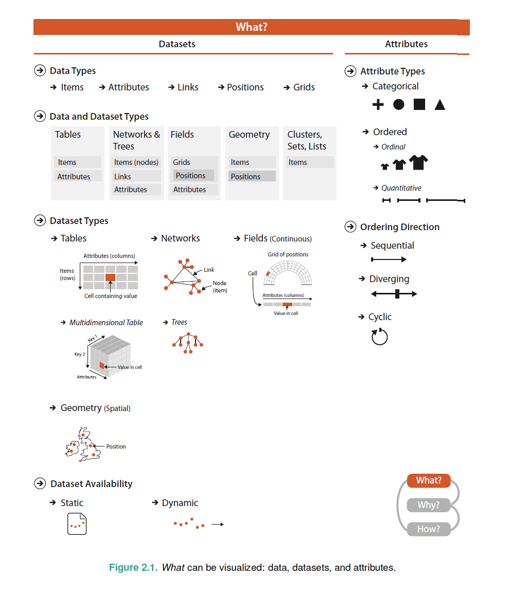
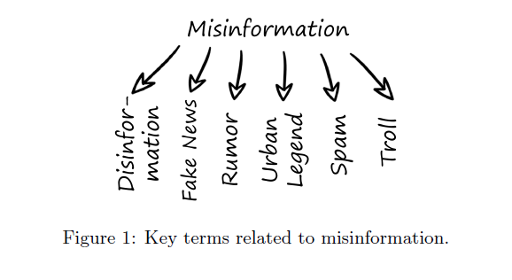
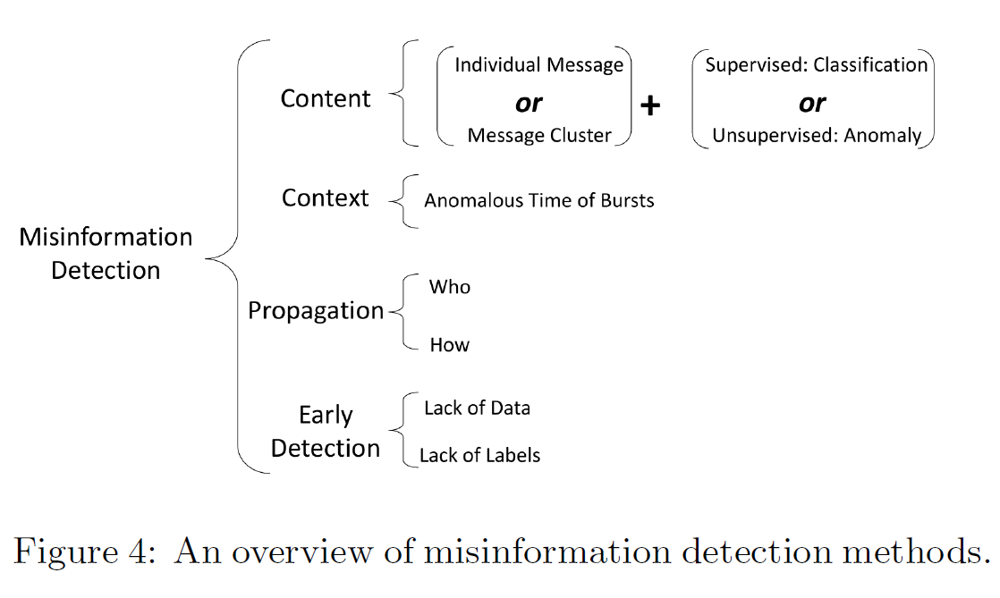

# Weekly Report in Week 4 June 2022

## 1. Book Notes

+ Visualization Analysis and Design
  + Chapter 1
    + 内容概括: 对可视化系统有一个明确定义，更重要的是，给出了一系列使用其，以及它所含内容的general的原因。
    + 对vis的定义非常认可：当需要增强人工能力而非彻底用计算进行决议从而代替人类时，可视化是适合的。私以为，很大一部分的应用还是面向人的，因此，一言以蔽之就是：以人为本。很多时候当然需要人参与其中，了解其中，这样的系统如何能够更好的辅助人，就需要可视化来进行（证明为什么选择视觉而非其他感官来实现，后文也有提及）
    + 作为一名可视化系统设计者，始终要考虑3种资源的限制也离不开这三种对象：计算机，人类以及他们如何展示。这也就是需要掌握的能力，计算机科学的众多知识，人类认知科学知识（也需要对人类用户群体所需有经验），最后是科学和艺术结合后的展示，高效且美观。
    + **要了解如何可视化先要了解其相关定义与意义，这也是该书的行文思路。** 一系列的原因：
      1. 可视化中为什么有人类参与：还有很多无法直接用模式语言和计算来解决的现实问题，还是需要人类介入并评判解决的。同时这些问题也并不少，且人类提前并不知道哪一个是正确的。
         1. 帮助理解和分析需求从而在未来能构建纯计算模型；一个短时间内人工无法被取代的领域，vis可以长期使用。
         2. 中间段，辅助用户参与和理解计算过程，从而帮助提升算法。
         3. 对终端用户，辅助他们进行应用场景的决策。
         4. 在科学发现中的Vis可长期使用。总之，无论如何，Vis正因是供人参考的，作用大致还是加速、提升人的能力，来生成、验证一些结论的，万变离不开人
      2. 可视化中为什么有计算机参与：人所应用的是Vis给其展示的内容。而机器则是在生成相应内容，更精准，更便捷，更效率，更复杂，而不用人工绘制。 运算以及绘制。
      3. 加入外部表示，增强认知层面各项能力。
      4. 为什么依靠的是视觉？（呼应前文所提）：依靠视觉所传递的信息按目前相比，是又快又多。
      5. 为何要展示数据的各项细节，再次就可以引入元数据，即解释数据的数据，可能一些描述数据的统计层面的值还并不能完美涵盖其全部特性，如书中给出的经典例子，通过可视化，可以看到4个在均值、方差和相关性上一致的不同之处。
      6. 为何使用交互手段：可以控制更为复杂的系统，展示更多的信息。单一静态可视化远不如可交互来的自由，用户所获信息也更少。
      7. 通过视觉编码 -> 交互手段，可以将多个图层进行管理，操作，以扩大设计空间。
      8. 为什么要关注任务需求：如果可以将任务抽象提取出来，可以避免vis限制在单一领域。
      9. 为何关注有效性：在明确了task后，才可以使vis更有效力。因此，明确任务，从抽象中分清主次，才会提升effectiveness。
      10. 为何大多设计又都是无效的：大多vis满足、匹配任务需求都是很困难的，更何况要达到完美。因此，只是满足需求大体就是可以的（satisfy is enough）；据此，作者还提出了作为vis设计者需要了解的一个满足任务的方法（理念）--> 层层递进，缩小范围，找出一个好的方案：从全部方案中->先选取你所知道的可能->从中选取值得你进一步思考的候选方案->在通过你的细致调查，来进一步缩小范围，选出一组方案，最后从中选取最好的。 而本书按作者所说，该书首先就是要扩大vis设计者在第二步中的known space。**不过总的来说，这一过程还是一个权衡利弊的折中过程。**
      11. 验证又为何如此困难：服务于人，满足需求是避免不了主观问题的。但给出一些标量化的评判指标可以更好的验证需求，但还是有很多限制是在纯粹的数学计算当中。
      12. 为什么有资源局限：可以分为，计算机方面的局限，人类方面的局限以及所展示内容的局限（信息密度）
      13. 为什么有需要分析呢：作者再次提到如他行文思路一致的what -> why -> how， 也对应了数据 -> 任务 -> 编码的过程。
    
  + Chapter 2
    
    
    
    + 明确了一些广泛事物的定义与目的，进一步了解可视化过程中的基础，数据，该篇套路数据集类型，数据类型（数据的动静态）以及属性的类型，属性中有序的类型与方向，可谓层层递进。
    + 首先在对数据分类之前，语义也不得不提，数据和信息不同，没有语义做基础，大体是无法让用户明白的，因此通过语义和数据类型来获取数据中的信息，解释数据的数据称为元数据。
    + 至于各层级的详细分类，该章首页就有一图足以涵盖。我们需要的是掌握分类中的不同之处，在合适场合运用合理类型（作者也说有些时候，部分类型是有交集的，经验也是不可缺失）
    + 对于数据集类型，文中讲，一般表格和网络是离散的键值关系，但是场（field）是连续的，他有着一个个的cell，都是一个可测量的连续区间。如果每个区间完全规则，则为网格（grid）；又为了区分几何类型，几何类型并不必须有属性；另外还有一些个其他组合（集合，列表，簇）
    + 对于发散这一ordering的方向，文中给出，他解构成两个序列指向相反的方向，在**公共的零点**相遇。
    + 还有一些经验上的提示：习惯上，能代表item唯一性的属性，最好放到第一列。
    + 从语义上，Field 各属性对应皆是位置范围而不是数据一一记录的确切点，毕竟field是连续的，视觉上只能用范围体现，而表格确实一一对应。同时，multivariate 为多属性，而multidimensional怎根据空间各点中所含信息的属性的阶数（单一属性 0，一个列表的属性 1，一个数组的属性 ≥ 2）来看也就对应着标量，向量和更高的张量。
    
  + Chapter 3
    
    
    
    + 要明确我为什么要用vis工具，也就是明确任务。作者对任务分解为动作与目标。对于动作，high-level的分析包括消耗和产生信息（细致分析如图）。middle-level则为搜索（根据搜索过程中所知来逐级分类），low level则为查询（认证，比较，总结）；对于目标，都是在找寻数据的趋势，不同（单个为值，多个为关系、结构）。
    + 作者鼓励要先从抽象上分析任务，不要以特定领域直接思考：
      + 全部特定化的话不容易找到各领域间的真正差异，什么看起来都像不同。
      + 抽象泛化以求通用，在一个框架下明确动作与目标，将任务抽象化来驱动指导数据进行抽象化
    + 这个vis是给谁用的，或是谁有一个目的，做一个决定：用户？ 设计者？
      + specific：对于用户，工具可用范围有限，可分析选用的数据也就有限；对于设计者而且会出现出现问题解决问题的情况，而非自顶向下的系统性构建vis
      + general：过于灵活，是双刃剑：可以做更多事，但是更低效。对于设计者，总的来说可以有一个更灵活的范围来控制。
    + 对于动作：分析，搜索，查询
      + 分析包括消耗和生成，不过消耗是单纯消耗现有信息，生成是通过分析原有数据生成新的可用信息
        + 消耗包括发现，表达和享受。
          1. 发现是一个从生成到验证的过程
          2. 表达就是一个交流，讲述的过程。在该section末，作者提到一个思路：即使用一个链式序列，将所发现的输出成为表达的输入。
          3. 享受与vis的邂逅。在这种情况下，用户不是被之前迫切的验证或生成假设的需求所驱动，而是被vis所激发和满足的好奇心所驱动。（有一种脱离世俗，自由探索反倒返璞归真有所得之的感觉）
        + 生成包括标注，记录和派生。
          1. 标注是对之前有过的可视化元素添加图形或文本注释。
          2. 记录则是可以记录或者捕捉他们（比如截图？另存为？）
          3. 派生则是根据已有数据生成一个全新的数据，作者道，派生数据之意义在于：可以极大地扩展vis的设计空间。尤其是对于一个复杂的、真实的用例设计vis，那么基于新属性和类型的更复杂的数据抽象通常是必要的。
      + 搜索包括l检查，定位，浏览和探索，他们是根据是否明确目标，以及是否明确需要的特定对象的位置来分层的。
    
  + 还有些觉得作者说的挺有意思的话，直接划在pdf上了。。

## 2. Misinformation in Social Media: Definition, Manipulation, and Detection (KDD 2019, 一篇对整个社交媒体各虚假消息有分类定义)

### misinformation -> 错误消息，误传的消息 

### 1. 对 misinformation 的定义 

+ misinformation as an umbrella term to include all false or inaccurate information that is spread in social media.  

  作者们最终将misinformation认为是： 文中伞状结构下的都算，即 -> 是在社交媒体中传播的错误或不精准信息 。

+ 作者们为什么这样做？ 平台上可以发布各种信息，导致很难分辨这些信息到底是不是故意编造出来的。（尽管故意与否是区分dis与misinformation的标准）。况且伞下的故意假情报，滥发信息，谣言和假新闻都有定义的特点。也都会造成负面影响 -> eg. **PizzaGate** 传播快广，影响大

+ 为了更好理解，进一步细分

  + **非故意传播的misinformation**
  
+ **故意的**
    + **都市传说** 本地的一些用来娱乐的故事，也是故意传播的

    + **虚假新闻**  通过新闻、社交媒体，也是故意
    
+ **未证实的信息** 或真或假，只有在最后证实是假的才算misinformation
  
  + **流言/谣言**  也是未证实的信息
  
+ **群体炒作**， eg. 有不良商家就雇人给自己的商品写正面评论，甚至败坏竞争对手的名声
  
  + **滥发的电邮** 垃圾消息
  
+ **发布挑衅的帖子**  对特定群体，钓鱼，引战。区别于其他misinformation，他企图扩大人们的间隙，仇恨。
  
  + **仇视言论**  对特定人群偏见，威胁
  
+ **网络欺凌，网暴** 可能涵盖任何misinformation的种类 （)

### 2和3主要结构是提出可行方法和方法的局限，进而继续解决，以及每个方法的适用范围。配合例子

### 2. 处理misinformation 用于对抗其攻击

+ 总： **更关注有意传播misinformation的人，因此处理的是 ： 分辨出misinformation的传播人**

  + 传统方法：关注他们的网络拓扑图以及过多的可怀疑内容，有别于常人。
  + 但对于一些最近事件，监督学习分类的表现急速下降。**用别人的合法账户，甚至盗别人号，通过操纵网络拓扑来假装是无害的账号**来以各种方式制造噪音。更复杂的是缺少分类标签，来捕获这些伪装内容和行为的信号。

+ 基于内容的处理方式

  社交系统用户通过创造传播内容定义。这种处理用到的分类方法 -> 二元分类，从以下方面进行

  + 内容

  + 配置文件 -> 适用于一些平台的特定用户。配置文件也可以直接用于识别错误信息

  + 外部资源链接，在一些帖子中嵌套url来指引用户到指定帖子。

  + 情感信息，内容中嵌入的情感信息还具有被用来检测政治错误信息及其不当行为

    监督

    不能说一个远比其他好，但目前可以用朴素贝叶斯，SVM，决策树以及 AdaBoost 

    既然这样，就完全可以把找出misinformation传播者看成一个二元分类算法。优势在于，高度依赖数据集。

    但是，如果恶意用户伪装过后，尤其是帖子，数据就被污染，因此又要对帖子进行分类，来找出识别污染数据的方法。关键就在于这样的数据很稀缺。

    进行自适应建模来解决 -> 以递归方式对内容和网络信息进行建模，以查找以下内容的帖子组：
    区分用户与其他人。 真实结果数据证明，这种自适应建模可以更好地帮助分类器识别可疑账户。

    无监督

    对于那些批量产生的数据，毕竟和正常信息有一定距离，通过他们来发现恶意行为。

+ 基于网络的处理方式

  背景：由于一些用户在被关注后会礼貌性的回关，就会使misinformation传播者与正常用户建立连接，这样二者就破坏了现有可用的方法，更有甚者，misinformation传播者建立了一个大群体。对于这些问题，非常适合使用社交网络中的图分类问题。

  先前在基于内容的里面，可以确定很多区别特征，但仅依赖于follwer 数量仅对某些有用，不大行。

  + 基于邻居，或一对用链接形成的一组用户，恶意群体一般专注于特定主题

  + 找组，找到后找出使用特定链接的打上标签，那么这些共同传播者就会被连起来一锅端。

    但这样，这两个方法都针对于特定传播者群体  第一类方法旨在实现可以将错误信息传播者分组在一起的组结构，而第二类方法旨在实现可以将错误信息传播者与组分离的组结构。一旦脱离这个范围，就会产生很多假结果，因此作者们正在进行自适应参数的讨论

### 3. 检测misinformation 

+ 总， 依旧是个分类问题，归纳文本类别，但是对于misinformation，虽然是故意编造，但是往往像是真的而且精确，那么只是关注于文本内容肯定不行，因此有四种思路：基于内容，基于上下文，基于传播，早期检测

+ 基于内容的检测手段

  这些研究更多地是文本匹配问题，找到原始的misinformation帖子。 这些方法在错误信息传播的后期阶段可能非常有帮助。 当某条信息被证明不正确或伪造时，文本匹配方法来查找所有相关帖子。 但是对于捕获有意重写的错误信息的方法来说，这是一个挑战

  现在的学习通常从Twitter和新浪微博等微博网站收集帖子和标签，然后根据收集到的内容和标签训练文本分类器，但这样主要是用misinformation中常出现的关键词来检测，对错误信息过度敏感，如果正常贴子含有这些，就会出现误判。

  于是可以采用消息集群来控制模型的敏感性，不但专注于单个帖子，根据时间内容作者进行聚类，从而找到可以的实例。但这个方法只能针对热度话题培训，且需要大量数据依托，适用于流行性错误信息

+ 基于上下文的检测手段

  在社交媒体平台上，上下文信息包括发布时间和地理位置。 它通常与其他信息一起使用以方便检测，或直接矢量化并用作其他功能。 另外，也有一些研究仅使用上下文信息。 Kwon等。 提出对错误信息的**突发模式建模（在后文亦有提及）**。 与一段时间内散布的合法帖子不同，作者认为错误信息帖子通常是连发发布的。 基本假设是，某些帐户组有意助长错误信息的发送，因此具有不同的帖子格式。 在较早的一项研究中发现了类似的发现，即谣言经常在突发事件中流行。

+ 基于扩散的检测手段

  信息扩散是指信息在社交网络中的传播方式，例如预测一条信息的最终影响 -> 如何使用传播信息来检测错误信息。关于利用信息扩散研究进行错误信息研究的更详细的介绍可以在先前的综述中找到[511]。

  由于故意的错误信息传播者可能会操纵内容使其看起来非常真实，因此从这些新兴应用程序的内容中获取有用的功能非常具有挑战性。(问题)  -> （可行方法）为了解决这个问题，最近的一些工作集中在对社交网络中消息的传播进行建模。 例如，一个名为TraceMiner的框架根据社交媒体用户的网络嵌入对消息的传播路径进行分类。 在真实数据集上的实验结果表明，与基于内容的方法相比，该方法可以提供较高的分类精度。 这是自然的，因为内容信息可能非常稀疏且嘈杂

  利用传播信息的主要识别方式是信息交换的方向可以**揭示社区结构和个人特征**。例如，基于新闻数据的内容，已经提出了非参数方法来推断社交媒体用户的主题兴趣[17]。因此，可以基于内容信息的收集来计算每个用户的主题兴趣的同质性，此外，他们发现可以利用相应的同质性来改善监督的错误信息形成检测系统，这是一个附加功能。除了对用户行为进行建模之外，传播信息还可以帮助您了解正在传播的新闻的特征。例如，以前的工作发现，虚假谣言具有流行的“暴躁”模式 **（也就是上文那个Kwon提出的理论）**而不是作为一条常规新闻仅流行一次，伪造和未经验证的信息可以在社交媒体上休眠和多次爆发。因此，这种事件模式有助于表征信息传播。

+ 对misinformation的早期检测

  与传统分类任务（主要侧重于优化性能指标，如准确性和F量度）相比，错误信息检测方法进一步考虑了该方法的早期性。 方法的早期性或及时性描述了错误信息检测方法可以为错误信息进行分类的速度。 **在这种情况下，存在两个挑战作为解决问题的关键问题，即**

  **缺乏数据和缺少标签**

  **因此，最近的研究介绍了相关技术**

  + 为了应对数据的缺乏，一个关键问题是允许在早期阶段聚合数据。现有的**大多数方法集中于从用户之间的对话中学习**，因为交互中表现出的内容，情感，讨论和辩论提供了有助于表征某个主题的上下文信息。但是，在错误信息传播的早期，讨论通常是分散的，需要花费一些时间才能发展成长时间的对话。为了缩短等待期，研究人员建议分析是否可以在早期捕获结构信息，以帮助将分散的讨论联系起来。特别是，讨论了三种类型的结构信息，包括主题标签，Web链接和内容相似性。主要的辨别方法是利用这样的链接将单个讨论合并到“对话”集群中。

  + 实际数据集上的实验结果表明，哈希标签是错误信息检测的最有用链接，所提出的方法无需等待对话的增长，而可以在形成过程中快速地从各个推文中学习，从而可以在发布第一批内容时检测到错误信息。另外，尽管当有更多数据可用时，所提出的方法和传统方法的性能趋于收敛，但是在后期阶段，链接不会削弱其性能。利用此类链接的一个关键问题是控制合并两个职位的阈值。提供了有关使用工程数量的链接如何实现一致精度的详细描述。
  + 直接使用已有标签又会不可避免地产生噪音。 可行方法：一种常见的做法是为每个错误信息事件构建一个标记的数据集。 例如，为了检测到某条虚假新闻，当前系统通常需要为其构建特定的训练数据集，并且该任务与文本搜索/匹配非常相似
  + 但是，始终要明确的是 --> 收集标签非常麻烦， 因此重复使用先前数据集。另外 不同misinformation会令用户产生不同反应，那么可以根据不同反应和评论来进行聚类，那么之前的数据集就可以用于新出现的错误信息推文，也突破了早期检测的两个瓶颈：数据和标签的稀缺。

### 4. 讨论 

+ 基本事实与评估还是关键

### 5. 总结与后续研究

## 3. Some New Words

+ spreadsheet: an electronic document in which data is arranged in the rows and columns of a grid and can be manipulated and used in calculations.
+ pertain: appropriate / related to  
+ contour:  an outline, especially one representing or bounding the shape or form of something.
+ impose: force (something unwelcome or unfamiliar) to be accepted or put in place.
+ recast: give (a metal object) a different form by melting it down and reshaping it.
+ elapsed: previous.
+ amenbale: (of a person) open and responsive to suggestion; easily persuaded or controlled.
+ indulge: allow oneself to enjoy the pleasure of.
+ serendipitous: occurring or discovered by chance in a happy or beneficial way.